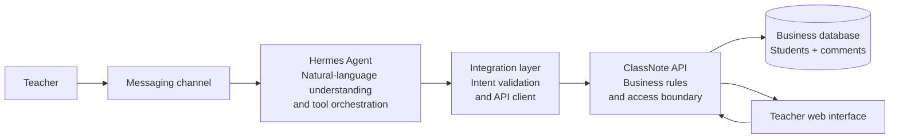

# ClassNote × Hermes Showcase

This repository is a sanitized showcase of the ClassNote business architecture, selected business-code modules, and its integration with Hermes Agent.

It contains no production deployment code, real user data, AI API keys, Telegram credentials, server configuration, database credentials, or local file paths.

## Business goal

Teachers often capture classroom observations as short, informal notes: a student understood a concept, helped a classmate, participated actively, or needs encouragement. ClassNote turns these observations into reviewable student comments without requiring the teacher to stop and complete a complex form.

A teacher can write a message such as:

> Add a note for Student A: they took the initiative to help a classmate organize the materials today.

The system then:

1. Understands the teacher's natural-language intent.
2. Matches the correct student.
3. Converts the observation into a structured comment.
4. Shows a preview and asks for confirmation before writing.
5. Places the new comment in a review queue.
6. Shows the approved comment in the student's timeline.

## Architecture



Hermes understands intent and selects approved tools. The ClassNote API validates business rules and performs data access. Hermes never connects directly to the database and never executes arbitrary SQL.

## Core data model

The business model is intentionally kept to two core tables:

| Table | Purpose |
|---|---|
| `student` | Student identity, student code, class, year level, and aliases |
| `comment` | Date, topic, category, comment text, evidence, source, and review status |

Comments reference students through `student_id`. If a name cannot be matched uniquely, the content can remain unassigned for review rather than being attached to the wrong student.

## Message flow

```text
Teacher's natural-language message
  → Hermes identifies the action, student, date, and content
  → Student lookup and uniqueness check
  → Write preview
  → Explicit teacher confirmation
  → ClassNote business API call
  → Comment enters the review queue
  → Teacher approval
  → Comment appears in the student timeline
```

## Integration principles

- The API is the only business data read/write entry point.
- Every write operation requires explicit confirmation.
- Ambiguous student names require a follow-up question; Hermes must not guess.
- New comments enter a pending-review state by default.
- Original natural-language input can be retained as source context, but does not bypass structured validation.
- User-facing errors are understandable and do not expose internal identifiers, paths, or credentials.
- The showcase uses abstract component names and placeholders only; it does not connect to a real service.

## Documentation

- [Business and Hermes integration architecture](docs/business-architecture.md)

## Business code snapshot

The public code is organized around the business flow:

```text
backend/app/models.py          two-table persistence model
backend/app/schemas/            API contracts
backend/app/repositories/      student and comment operations
backend/app/services/           matching and text ingestion
backend/app/api/                student and comment endpoints
frontend/src/                   teacher-facing workflow pages
```

This is a reviewable business-code snapshot. Deployment files, environment files, database snapshots, provider adapters, messaging credentials, and local development server settings are intentionally excluded.

## Hermes feature integration notes

The following notes record how selected Hermes capabilities could be integrated into ClassNote. Each feature is evaluated at the system boundary first; the public code snapshot remains intentionally provider-neutral and does not contain operational Hermes configuration.

### 1. Tools and toolsets

**Capability.** Hermes groups callable tools into toolsets that can be enabled or disabled per platform. The documented tool categories include web, terminal and file operations, orchestration, memory, automation, and integrations.

**ClassNote integration.** Add a small, dedicated ClassNote toolset containing only business-safe operations such as `find_students`, `preview_comment`, `submit_comment`, and `list_review_queue`. Hermes can use read-only tools for lookup and preview; the write tool should be exposed only after an explicit confirmation turn. The integration layer remains an API client, so Hermes never receives database credentials and never generates executable SQL.

**End-to-end flow.** Telegram message → Hermes intent extraction → student lookup tool → disambiguation if needed → preview tool → teacher confirmation → submit tool → ClassNote API validation → pending comment. The API should enforce the same rules even if a tool is called incorrectly.

**Interfaces and feasibility.** Define stable JSON schemas for tool inputs and outputs, include an idempotency key for writes, and return user-safe error codes. This is highly feasible because it fits the existing API boundary; the main dependency is a Hermes adapter that registers the allowlisted tools.

**Security decision.** Do not enable general terminal, filesystem, or arbitrary database tools for the production ClassNote conversation. Keep business tools narrowly scoped, log tool names and request IDs rather than raw student content, and require confirmation for every mutation.

Source: [Hermes Tools & Toolsets](https://hermes-agent.nousresearch.com/docs/user-guide/features/tools) and [Hermes feature overview](https://hermes-agent.nousresearch.com/docs/user-guide/features/overview).

### 2. Skills system

**Capability.** Hermes skills are on-demand knowledge and workflow documents. They are loaded when relevant instead of being placed into every prompt, and can encode repeatable procedures, domain rules, and tool usage.

**ClassNote integration.** Provide a sanitized `classnote-comment-workflow` skill for the Hermes agent. It should describe how to recognize an observation, map it to the two-table model, resolve aliases, ask for clarification, create a preview, and request confirmation. The skill should contain examples and validation rules, but no student roster, secret, local path, or provider credential.

**End-to-end flow.** A teacher message activates the skill → the skill selects the allowlisted ClassNote tools → the API returns candidate students or a preview → Hermes follows the confirmation protocol → the API stores the pending comment. The skill improves consistency, while the API remains authoritative for validation.

**Interfaces and feasibility.** Version the skill with the public business contract and test it against representative ambiguous-name and duplicate-name cases. Keep the tool names and JSON fields aligned with `backend/app/schemas/`; no database change is required for the first version. This is feasible and is a low-risk way to keep natural-language behavior maintainable.

**Security decision.** Treat skills as instructions, not as a trust boundary. Never place credentials or real student data in a skill. The integration layer must reject tool calls that violate authorization, confirmation, class scope, or field constraints, even when the skill suggests them.

Source: [Hermes Skills System](https://hermes-agent.nousresearch.com/docs/user-guide/features/skills).

### 3. Persistent memory

**Capability.** Hermes keeps bounded, curated memory across sessions, with separate space for agent notes and user preferences. The documentation also warns that memory is scoped to an agent profile and should not be shared casually by multiple agent processes.

**ClassNote integration.** Use memory only for low-risk teacher preferences: a default class, preferred language, preferred comment tone, or whether previews should include evidence. Do not use it as the source of truth for student identity, safeguarding information, grades, or comment history; those belong behind the ClassNote API.

**End-to-end flow.** Teacher sets a preference → Hermes stores a minimal preference entry → later message is interpreted with that preference → the integration layer still sends explicit class and student identifiers to the API → the API applies authorization and business validation. A preference must never silently select among two students with the same name.

**Interfaces and feasibility.** Add a profile-scoped preference adapter with `get_preferences` and `update_preferences`, or start with Hermes-managed memory and keep the ClassNote API stateless. The first option is feasible for a single teacher; a multi-teacher deployment should move shared preferences into an authenticated service with tenant isolation.

**Security decision.** Apply data minimization, retention limits, and an exclusion list for sensitive student data. Provide a reset path and show the teacher when a stored preference affects a preview. Memory failures should degrade to an explicit question, not to a guessed class or student.

Source: [Hermes Persistent Memory](https://hermes-agent.nousresearch.com/docs/user-guide/features/memory).

### 4. Context files

**Capability.** Hermes discovers project context files and uses them to shape behavior, including project instructions, conventions, architecture notes, and personality guidance. The discovery and priority rules make repository-level instructions reusable across sessions.

**ClassNote integration.** Maintain a sanitized project context document that describes the ClassNote domain vocabulary, two-table model, API boundary, review states, confirmation rules, and examples of safe responses. This gives Hermes a stable contract for natural-language orchestration without embedding operational configuration in the public code snapshot.

**End-to-end flow.** Hermes loads the project context at session start → teacher sends an observation → the agent applies the domain rules → selected tools perform lookup and preview → ClassNote validates and persists the result. When the contract changes, update the context document and the API schemas together.

**Interfaces and feasibility.** Add a versioned context contract beside the business documentation and test it with the same sample messages used by the API tests. Keep deployment-specific instructions in a private, untracked override rather than in the showcase repository. This is immediately feasible and does not require a schema change.

**Security decision.** Context files are prompt inputs, not access control. They must not contain credentials, private endpoints, local machine paths, real student records, or instructions that bypass API validation. A repository scan should run before publishing changes.

Source: [Hermes Context Files](https://hermes-agent.nousresearch.com/docs/user-guide/features/context-files).

### 5. Context references

**Capability.** Hermes can expand references such as a file, folder, diff, recent Git history, or URL inline in a message. This lets a user attach precise context without copying an entire document into chat.

**ClassNote integration.** Use references for teacher-controlled, reviewable inputs such as a sanitized class roster export, an observation draft, or a selected report. The integration layer should convert referenced content into a bounded structured payload before calling ClassNote; a reference must never become a direct database or filesystem capability.

**End-to-end flow.** Teacher attaches an allowed context reference → Hermes receives the expanded content → the skill extracts student candidates and observation text → Hermes calls read-only lookup and preview tools → teacher confirms → the API writes the pending comment. If the reference is too large, unsupported, or ambiguous, the agent asks for a narrower input.

**Interfaces and feasibility.** Define an attachment envelope with source type, content hash, size limit, and redaction status. Add an API-side validation step that accepts only the fields needed by the comment workflow. This is feasible for file-based workflows; URL references should remain disabled initially because they create an additional data-exfiltration and freshness boundary.

**Security decision.** Enforce an allowlist of reference types and paths in the Hermes integration layer, strip secrets and unnecessary personal data, and avoid returning raw attachments in logs. Never allow `@diff` or arbitrary URLs to bypass the confirmation and privacy checks.

Source: [Hermes Context References](https://hermes-agent.nousresearch.com/docs/user-guide/features/context-references).

### 6. Checkpoints and rollback

**Capability.** Hermes can snapshot a project before destructive file or terminal operations and restore a previous checkpoint. The feature is a development safety net; it is separate from the application's business data.

**ClassNote integration.** Enable checkpoints for Hermes work that edits the public integration skill, context contract, or showcase code. For runtime comments, use ClassNote's domain workflow instead: a pending review queue, explicit approval, and a correction path. Rolling back a project file must not be treated as rolling back a comment already written to the API.

**End-to-end flow.** Hermes prepares a code or contract change → checkpoint is created → tests and security scan run → the change is committed or restored. Separately, a teacher message follows preview → confirmation → API write → review. The two rollback domains stay clearly separated in the user-facing status message.

**Interfaces and feasibility.** No production schema change is needed. Add an audit or request ID to the API response so the UI can direct a teacher to edit or reject the domain object rather than suggesting a filesystem rollback. This is feasible and useful for maintaining the integration artifacts.

**Security decision.** Checkpoints may retain historical file content, so they need the same access and retention controls as the workspace. Never checkpoint a directory containing runtime secrets or real student exports in the public showcase workflow, and do not expose rollback commands through the teacher-facing business toolset.

Source: [Hermes Checkpoints and `/rollback`](https://hermes-agent.nousresearch.com/docs/user-guide/checkpoints-and-rollback).

### 7. Scheduled tasks (Cron)

**Capability.** Hermes exposes scheduled one-shot and recurring tasks through a cron tool. Jobs can be paused, resumed, edited, triggered, and delivered back to the originating chat or a configured platform target; a job may also run without an LLM when a deterministic script is sufficient.

**ClassNote integration.** Use this for read-only classroom workflows such as a daily pending-review digest, a weekly observation summary, or a reminder to review unapproved comments. A scheduled job may call a reporting endpoint and send a concise result to the teacher, but it must not silently create comments or approve them.

**End-to-end flow.** Teacher asks Hermes to schedule a digest → Hermes stores the schedule → at fire time the job calls a scoped ClassNote reporting tool → the API checks teacher and class access → Hermes formats the result → the configured messaging adapter delivers it. Any write action should return to the normal preview and confirmation flow.

**Interfaces and feasibility.** Add a read-only `review_summary` API contract with a time window, class scope, and result limit. Keep schedule ownership and provider/model policy in the Hermes runtime at first; only add a ClassNote schedule table if product requirements later need a web dashboard or cross-channel management. This is feasible as a low-risk read path.

**Security decision.** Require an explicit owner and class scope for every job, avoid placing student names in job titles, pin the execution policy for unattended jobs, and fail closed when authorization or the configured model is unavailable. Do not put credentials, private destinations, or raw student records into the public repository.

Source: [Hermes Scheduled Tasks](https://hermes-agent.nousresearch.com/docs/user-guide/features/cron).

### 8. Subagent delegation

**Capability.** Hermes can delegate independent work to child agents with isolated context and inherited tool access. The parent receives a final summary, while background completion delivery can be retried when a gateway or session route is temporarily unavailable.

**ClassNote integration.** Delegate bounded, read-only tasks such as summarizing observations for separate classes, checking alias candidates, or generating a draft report. The parent agent remains the orchestrator: it combines results, resolves conflicts, presents one preview, and owns the only confirmation that can reach a write tool.

**End-to-end flow.** Parent receives a request → partitions it by class or report section → children call scoped read-only ClassNote tools → each child returns structured findings with confidence and source IDs → parent merges and deduplicates → teacher confirms the final preview → parent performs one idempotent API write per approved comment.

**Interfaces and feasibility.** Define a child-task envelope containing tenant, teacher, class scope, purpose, deadline, and maximum records; define a structured result with errors instead of free-form success claims. Add bounded concurrency and retry handling. This is feasible for reporting, but should not be the first path for simple single-student comments.

**Security decision.** Children receive the minimum data and tools necessary, never credentials or unrestricted terminal access. Child agents cannot approve comments, alter class membership, or write directly. Treat late, duplicated, or partial completions as untrusted until the parent validates them and the API enforces idempotency.

Source: [Hermes Subagent Delegation](https://hermes-agent.nousresearch.com/docs/user-guide/features/delegation).

### 9. Code execution

**Capability.** Hermes can run generated Python that calls Hermes tools programmatically. Intermediate tool results stay inside the script and only the final printed output returns to the model, which is useful for loops, filtering, and multi-step transformations.

**ClassNote integration.** Use this capability for deterministic, bounded processing around the API: normalize a batch of observations, validate candidate mappings, calculate a report, or transform a review-queue response into a teacher-friendly summary. The script should call typed ClassNote tools or the integration client, never construct SQL or open the database directly.

**End-to-end flow.** Hermes receives a batch request → a sandboxed script calls read-only ClassNote operations → the script validates and reduces the results → it prints a typed summary → Hermes presents a preview or asks a follow-up question. Any mutation still goes through the normal confirmation and API write tool outside the script.

**Interfaces and feasibility.** Define maximum input size, execution time, output schema, and allowed tool names. Start with read-only report generation; add a separate, audited batch-write operation only after idempotency and partial-failure behavior are proven. This is feasible, but it is more complex than direct tool calls and should be reserved for genuinely multi-step work.

**Security decision.** Run with no database socket, no secret environment variables, no unrestricted network, and no arbitrary filesystem access. Redact student content from exceptions and logs. If the sandbox is unavailable, fail closed and return a normal user-facing error rather than falling back to arbitrary shell execution.

Source: [Hermes Code Execution](https://hermes-agent.nousresearch.com/docs/user-guide/features/code-execution).

### 10. Event hooks

**Capability.** Hermes provides gateway, plugin, shell, and outbound webhook hooks at lifecycle points. Hooks can log, transform, inject context, measure activity, or block a tool call; callback failures are isolated, while control hooks can fail closed.

**ClassNote integration.** Add a narrow integration hook set for audit and guardrails: record a request ID and high-level action, reject a write without a confirmation token, attach correlation metadata to API calls, and publish non-sensitive metrics for latency and errors. A post-write event can update observability, but the ClassNote API remains the source of truth for the result.

**End-to-end flow.** Telegram message enters Hermes → a pre-tool hook checks platform identity, allowed tool, class scope, and confirmation state → the integration client calls ClassNote → the API validates and persists → a post-tool hook records success or failure without raw student text → Hermes replies with the API result. Hook failure must never turn an unconfirmed request into a write.

**Interfaces and feasibility.** Standardize a small event envelope with event type, correlation ID, actor scope, tool name, outcome, and retention classification. Keep business authorization in the API and use hooks as a second guardrail and audit signal. This is feasible and valuable once the basic toolset exists; begin with logging and pre-write blocking.

**Security decision.** Do not log credentials, full message bodies, audio, or unrestricted API responses. Sign outbound events if an external audit sink is added, rate-limit retries, and make write operations idempotent. Test both hook failure and duplicate delivery so the teacher never sees a false success.

Source: [Hermes Event Hooks](https://hermes-agent.nousresearch.com/docs/user-guide/features/hooks).

### 11. Document extraction

**Capability and business value.** Hermes can convert common Word, spreadsheet, notebook, and PDF files into paginated Markdown, and can warn when scanned PDF pages have no text layer. This lets teachers use existing roster exports or observation worksheets without retyping them.

**Proposed integration and data flow.** Add an attachment-ingestion adapter before the existing intent layer: approved attachment → type and size validation → Hermes extraction → coverage and redaction check → structured candidate records → student lookup or comment preview → explicit confirmation → ClassNote API.

**Implementation boundary.** No database change is needed initially. Add an attachment envelope with type, size, checksum, extraction status, and source reference. Keep extracted text ephemeral unless retention is explicitly requested.

**Risks and recommendation.** Documents may contain unrelated personal data, hidden formulas, or unreadable scans. Enforce limits, redact unnecessary fields, and never log raw documents. Recommend a read-and-preview pilot using sanitized exports before bulk writes.

Source: [Hermes Document Extraction](https://hermes-agent.nousresearch.com/docs/user-guide/features/document-extraction).

### 12. Tool Search

**Capability and business value.** Hermes can defer MCP and non-core plugin schemas and discover them progressively through search, description, and call bridge tools. This reduces prompt noise when a ClassNote deployment eventually has reporting, storage, calendar, and messaging integrations.

**Proposed integration and data flow.** Keep student lookup, preview, and submit tools in a fixed allowlist; put optional read-only tools behind Tool Search: user intent → catalog search → schema description → local argument validation → approved integration client → ClassNote API or another explicitly permitted service.

**Implementation boundary.** No database change is required. Maintain a tool registry with capability ID, operation type, authorization scope, and confirmation requirement. A discovered tool name must never become permission to access arbitrary data.

**Risks and recommendation.** Retrieval may select the wrong tool, and newly installed plugins can expand the reachable surface. Restrict the catalog per session, keep writes non-discoverable until explicitly enabled, and audit the resolved tool name. Recommend this only when the optional toolset becomes large.

Source: [Hermes Tool Search](https://hermes-agent.nousresearch.com/docs/user-guide/features/tool-search).

### 13. LSP semantic diagnostics

**Capability and business value.** Hermes can run language servers after file edits and report new semantic diagnostics such as type errors, unresolved names, and missing imports. This is useful for keeping the ClassNote backend, frontend, and integration client aligned.

**Proposed integration and data flow.** Use LSP during development, not in the teacher-facing workflow: developer edits integration code → Hermes captures a baseline → the change is applied → new diagnostics are reported → tests and review decide whether the change is publishable.

**Implementation boundary.** No runtime database or API change is required. Keep language-server setup generic and treat API contract tests as the authority for business correctness.

**Risks and recommendation.** Toolchain differences can create noisy or incomplete diagnostics, and a clean semantic check does not prove correct student matching. Recommend LSP as a development quality gate and never as a production dependency.

Source: [Hermes LSP — Semantic Diagnostics](https://hermes-agent.nousresearch.com/docs/user-guide/features/lsp).

### 14. Curator

**Capability and business value.** Hermes Curator tracks use of agent-created skills, moves inactive skills through active, stale, and archived states, and proposes consolidation or drift fixes. This can prevent multiple ClassNote workflow skills from competing for context.

**Proposed integration and data flow.** Protect the core comment workflow skill and use Curator for optional report-writing, roster-import, and experimental skills: skill update → usage tracking → inactivity or drift signal → maintainer reviews proposed change → approved version is published or safely archived.

**Implementation boundary.** No ClassNote database change is needed. Keep skill ownership, version, and review metadata in the private maintenance process rather than in student or comment tables.

**Risks and recommendation.** A rarely used safeguarding rule could be misclassified as stale, and generated patches can change behavior. Exclude mandatory skills, review every patch, and preserve recoverable history. Recommend Curator after the skill library grows beyond manual management.

Source: [Hermes Curator](https://hermes-agent.nousresearch.com/docs/user-guide/features/curator).

### 15. External memory providers

**Capability and business value.** Hermes supports external memory-provider plugins for cross-session knowledge, background prefetching, conversation synchronization, memory extraction, and provider-specific memory tools. This could reduce repeated setup questions about a teacher’s preferred language or comment tone.

**Proposed integration and data flow.** Use an external provider only for teacher-scoped preferences: opt-in → provider returns preference context → Hermes drafts a preview → ClassNote API validates current student data → teacher confirms → only permitted preference metadata is synchronized.

**Implementation boundary.** No core database change is required initially. Define a provider-neutral preference contract, consent and deletion controls, retention policy, and tenant scope. Provider credentials and configuration stay outside the public repository.

**Risks and recommendation.** External storage expands the privacy boundary and may return stale or cross-tenant context. Start with built-in memory, prohibit student records from synchronization, and add a provider only after consent and deletion behavior are tested.

Source: [Hermes Memory Providers](https://hermes-agent.nousresearch.com/docs/user-guide/features/memory-providers).

### 16. Honcho Memory

**Capability and business value.** Honcho is a memory provider that builds a persistent model of user preferences, communication style, goals, and patterns, with session summaries, semantic search, conclusions, and separated peer profiles. It may improve continuity for a teacher but is unnecessary for a simple comment.

**Proposed integration and data flow.** If evaluated, connect it only to a teacher-preference adapter: opt in → retrieve scoped preference context → generate preview → ClassNote performs identity and business validation → teacher confirms → record a minimal preference update if permitted.

**Implementation boundary.** No student or comment schema change is needed. Add consent, provider status, and deletion controls at the integration or account-settings layer, with a hard separation between teacher profile data and classroom records.

**Risks and recommendation.** Inferred personal information can exceed the teacher’s intent, and an external provider adds compliance and availability dependencies. Recommend not adopting Honcho for the first production version; consider only a tightly limited preference pilot.

Source: [Hermes Honcho Memory](https://hermes-agent.nousresearch.com/docs/user-guide/features/honcho).

### 17. Mixture of Agents

**Capability and business value.** Hermes can use a Mixture of Agents preset in which reference models analyze first and an aggregator produces the response and tool calls while preserving the normal Hermes loop. Multiple perspectives may help with ambiguous names or mixed observations.

**Proposed integration and data flow.** Route only high-ambiguity drafting and reporting to MoA: Telegram request → reference analysis → aggregator produces structured intent → read-only lookup and preview → teacher confirmation → ClassNote API write → review queue. Simple messages should use the normal path.

**Implementation boundary.** No database change is required. Add routing based on ambiguity, task type, and latency budget, with a correlation ID for comparing MoA and normal-model outcomes.

**Risks and recommendation.** MoA increases latency, cost, provider complexity, and draft variance. It cannot replace deterministic identity matching or confirmation. Recommend offline evaluation first, then an opt-in fallback for difficult read and preview cases.

Source: [Hermes Mixture of Agents](https://hermes-agent.nousresearch.com/docs/user-guide/features/mixture-of-agents).

### 18. Personality and SOUL.md

**Capability and business value.** Hermes uses a durable personality file as the agent identity, with optional session-level personality presets. A consistent, calm, teacher-friendly voice can make clarification questions and confirmation prompts easier to understand.

**Proposed integration and data flow.** Define a ClassNote communication style that is concise, supportive, transparent about uncertainty, and explicit about confirmation: Hermes loads the approved style → interprets the message → presents a preview or clarification → reports the API result without changing its meaning.

**Implementation boundary.** No database or API change is required. Keep the approved style separate from skills and API authorization, and keep the public example free of credentials, private endpoints, and student data.

**Risks and recommendation.** Personality text can be edited or misinterpreted and must never override privacy, confirmation, or API validation. Recommend a small reviewed style guide with regression examples rather than a broad persona that invents policy.

Source: [Hermes Personality & SOUL.md](https://hermes-agent.nousresearch.com/docs/user-guide/features/personality).

### 19. Plugins

**Capability and business value.** Hermes plugins add custom tools, hooks, and integrations without changing Hermes core. A ClassNote plugin can package the business boundary cleanly and keep Telegram tools separate from generic Hermes capabilities.

**Proposed integration and data flow.** Register typed tools for student lookup, preview, submit, and review queue operations: Hermes loads the plugin → model selects a tool → plugin validates scope and arguments → authenticated API client calls ClassNote → API applies business rules → plugin returns a safe result.

**Implementation boundary.** No database change is needed. Maintain plugin version, supported API contract, capability allowlist, and compatibility tests. Do not include credentials, operational configuration, or real endpoints in the public repository.

**Risks and recommendation.** A plugin executes code inside the Hermes runtime and can become an alternate path around guardrails. Pin versions, review handlers, restrict tools by profile, and fail closed on missing authorization. Recommend this as the preferred production integration boundary once the API contract is stable.

Source: [Hermes Plugins](https://hermes-agent.nousresearch.com/docs/user-guide/features/plugins).

### 20. Batch processing

**Capability and business value.** Hermes batch processing runs many isolated agent sessions over a JSONL prompt dataset and produces structured trajectories, tool-call statistics, and evaluation metrics. ClassNote can use it to test natural-language understanding against synthetic classroom messages.

**Proposed integration and data flow.** Synthetic prompt dataset → isolated Hermes sessions → mocked or read-only ClassNote tools → structured trajectories → evaluator measures intent accuracy, ambiguity handling, and unsafe-write rate → approved skill or prompt changes.

**Implementation boundary.** No production database change is required. Add an offline evaluation harness and versioned synthetic fixtures if needed; never use real student records or credentials in a batch dataset.

**Risks and recommendation.** Parallel runs can create cost, rate-limit pressure, and misleading results if the corpus lacks realistic ambiguity. Cap concurrency, track model and provider versions, and require human review for safety metrics. Recommend batch processing as a quality gate, not a production write mechanism.

Source: [Hermes Batch Processing](https://hermes-agent.nousresearch.com/docs/user-guide/features/batch-processing).

### 21. Voice Mode

**Capability and business value.** Hermes supports voice interaction across CLI and messaging surfaces, including voice input, transcription, and optional spoken replies. For ClassNote, voice input can let a teacher capture a quick observation while moving around the classroom.

**Proposed integration and data flow.** Telegram voice message → Hermes gateway receives audio → local speech-to-text produces text → Hermes extracts intent and student candidate → ClassNote preview → teacher confirms → API stores a pending comment. Keep the audio outside the business database unless retention is explicitly required.

**Implementation boundary.** The existing two-table model is sufficient. Add only a transient voice-message envelope containing source, transcription status, confidence, and correlation ID; the integration layer passes text, not audio, to the business API.

**Risks and recommendation.** Background noise, names, and accents can cause unsafe student matching. Require a preview, show the transcription, ask when confidence is low, and redact audio from logs. Recommend voice input as an optional convenience with the current local faster-whisper path.

Source: [Hermes Voice Mode](https://hermes-agent.nousresearch.com/docs/user-guide/features/voice-mode).

### 22. Browser Automation

**Capability and business value.** Hermes can navigate websites, interact with page elements, fill forms, and extract information through local or cloud browser backends. This could help import a teacher-selected roster or inspect a report from an approved education system.

**Proposed integration and data flow.** Teacher explicitly requests an import → Hermes opens an allowlisted site → extracts a bounded table → integration layer validates and redacts fields → ClassNote previews proposed student changes → teacher confirms → API persists only approved records. Browser automation must not be the normal path for adding comments.

**Implementation boundary.** Keep browser credentials and sessions in Hermes or the private integration layer. Add a structured import contract with source label, checksum, column mapping, and review status; do not let browser code access the database directly.

**Risks and recommendation.** Pages change, sessions may contain sensitive data, and cloud browsing adds a third-party privacy boundary. Prefer an official export or API, use local browser mode only when necessary, and require human review. Recommend this as a controlled import fallback, not a core ClassNote dependency.

Source: [Hermes Browser Automation](https://hermes-agent.nousresearch.com/docs/user-guide/features/browser).

### 23. Vision and image paste

**Capability and business value.** Hermes can accept pasted images and send them to a vision-capable model for analysis. A teacher might use this to inspect a photographed observation sheet, handwritten note, or classroom artifact.

**Proposed integration and data flow.** Teacher attaches an image → Hermes performs vision analysis → integration layer extracts only the intended observation and candidate student → ClassNote returns a preview → teacher confirms → pending comment is stored. The original image should expire unless the teacher explicitly retains it.

**Implementation boundary.** No student or comment schema change is required. Use a temporary attachment object with size, checksum, redaction status, and extraction confidence; send structured text to the API rather than image content.

**Risks and recommendation.** Images may reveal faces, names, handwriting, or unrelated children, and vision can misread text. Require a clear subject, mask unrelated regions, display extracted text for review, and block low-confidence writes. Recommend a limited pilot with synthetic or teacher-created materials.

Source: [Hermes Vision & Image Paste](https://hermes-agent.nousresearch.com/docs/user-guide/features/vision).

### 24. Image Generation

**Capability and business value.** Hermes can generate images from text prompts through supported image-generation backends. For ClassNote, the safe value is creating neutral dashboard illustrations, classroom workflow diagrams, or visual assets for training material.

**Proposed integration and data flow.** Teacher or maintainer requests an illustration → Hermes generates an image → frontend asset review checks accessibility and appropriateness → approved asset is stored with the showcase or private web app. Generated images should not represent real students or infer student performance.

**Implementation boundary.** This is a frontend and content workflow, not a student-data operation. No database change is required. Keep generated assets separate from student comments and do not send private classroom records into image prompts.

**Risks and recommendation.** Prompts can accidentally disclose personal information, generated imagery can be misleading, and provider usage can have cost or retention implications. Use synthetic prompts, review outputs, and keep the feature disabled in the comment-writing toolset. Recommend it only for documentation and neutral UI assets.

Source: [Hermes Image Generation](https://hermes-agent.nousresearch.com/docs/user-guide/features/image-generation).

### 25. Voice and TTS

**Capability and business value.** Hermes supports speech-to-text and optional text-to-speech across messaging platforms. TTS could make review reminders more accessible, but it is not required for the ClassNote workflow.

**Proposed integration and data flow.** Keep incoming Telegram audio on the local STT path → Hermes produces text → ClassNote performs lookup, preview, and confirmation → return a normal text response. If spoken output is later enabled, synthesize only the short response after the API result is known; never speak an unconfirmed write as completed.

**Implementation boundary.** No database change is needed. Treat STT as an input adapter and TTS as an optional presentation adapter. For this showcase, use local faster-whisper for STT and do not add a separate TTS model or credential.

**Risks and recommendation.** Transcripts can misrecognize names, spoken output can be overheard, and optional providers may send content outside the private environment. Keep TTS disabled initially, display the written preview, and require explicit opt-in for any future spoken response.

Source: [Hermes Voice & TTS](https://hermes-agent.nousresearch.com/docs/user-guide/features/tts).

### 26. MCP integration

**Capability and business value.** Hermes can connect to local or remote Model Context Protocol servers, discover their tools, and apply per-server filtering. This could connect ClassNote to an approved external roster, calendar, or reporting system without adding each integration to Hermes core.

**Proposed integration and data flow.** Teacher requests an approved external action → Hermes selects a filtered MCP capability → integration policy validates the operation and scope → external result is normalized → ClassNote preview or report is generated → any write still requires confirmation and API validation.

**Implementation boundary.** Prefer a narrow ClassNote API or plugin for core student and comment operations. Use MCP only for external read-heavy systems, with typed adapters and no direct database access. No ClassNote schema change is required initially.

**Risks and recommendation.** MCP servers can introduce credentials, remote execution, schema drift, and unexpected data exposure. Allowlist servers and tools per profile, keep write tools disabled by default, and review every server version. Recommend MCP for optional external integrations, not the core comment path.

Source: [Hermes MCP Integration](https://hermes-agent.nousresearch.com/docs/user-guide/features/mcp).

### 27. Provider routing

**Capability and business value.** Hermes can apply fine-grained routing rules when using a multi-provider gateway, prioritizing providers by price, latency, throughput, supported parameters, or data-collection policy. This helps separate cost and privacy decisions from application code.

**Proposed integration and data flow.** Integration layer classifies the request → policy selects an approved model route → Hermes processes the intent → ClassNote receives only the structured, validated operation. Sensitive student observations should use a route that satisfies the organization’s data policy; routing must not be decided by free-form user text.

**Implementation boundary.** No database change is needed. Keep routing policy in private runtime configuration and expose only a provider-neutral capability to the ClassNote adapter. The public repository documents the policy shape without real endpoints or credentials.

**Risks and recommendation.** Different providers may change quality, retention, latency, or tool support, and routing can be ignored on some provider paths. Pin approved routes, record policy version and correlation ID, and evaluate identity accuracy per route. Recommend routing only after privacy and quality requirements are explicit.

Source: [Hermes Provider Routing](https://hermes-agent.nousresearch.com/docs/user-guide/features/provider-routing).

### 28. Fallback providers

**Capability and business value.** Hermes can switch to a backup provider and model when the primary fails, while preserving conversation history and tool context. This may keep a teacher’s request available during a transient provider outage.

**Proposed integration and data flow.** Telegram request → primary Hermes model → transient failure detected → approved fallback selected → intent and preview continue → ClassNote API validates → teacher confirms → pending comment is stored. A fallback must not bypass the same tool and confirmation rules.

**Implementation boundary.** No database change is required. Define a private fallback policy with allowed providers, supported tools, privacy classification, and maximum retry time. For student content, use only providers that meet the data policy; otherwise return a safe retry message.

**Risks and recommendation.** Fallback can send classroom content to a different processor and can produce a different interpretation. It also resets provider-side prompt-cache assumptions. Recommend fallback for availability only after provider equivalence, privacy, and ambiguous-name tests pass; never fail over into an unapproved route.

Source: [Hermes Fallback Providers](https://hermes-agent.nousresearch.com/docs/user-guide/features/fallback-providers).

### 29. Credential pools

**Capability and business value.** Hermes can rotate among multiple credentials for the same provider when rate limits or quotas are reached. This is an operational resilience feature, not a business-data feature.

**Proposed integration and data flow.** Request enters Hermes → private credential manager chooses a healthy credential → model produces intent or preview → ClassNote API validates the result. If all credentials are exhausted, the system returns a controlled unavailable response rather than exposing credentials or silently changing data policy.

**Implementation boundary.** No ClassNote database change is required. Store credentials only in the private Hermes runtime or secret manager; the public repository contains no key names with values, credential files, or operational setup. The integration layer sees only a provider result and correlation ID.

**Risks and recommendation.** Rotation can complicate auditing, reset provider-side cache benefits, and make quota ownership unclear. Track provider and policy metadata without logging secrets, set per-tenant budgets, and keep the pool separate from student records. Recommend this only for a managed deployment with multiple approved credentials.

Source: [Hermes Credential Pools](https://hermes-agent.nousresearch.com/docs/user-guide/features/credential-pools).

### 30. API Server

**Capability and business value.** Hermes can expose an OpenAI-compatible HTTP interface, allowing a web client to use Hermes as a model-and-tools backend. This could provide a second conversational entry point beside Telegram.

**Proposed integration and data flow.** ClassNote web interface sends a message to the private Hermes API → Hermes interprets intent and calls the approved integration tool → ClassNote API validates lookup, preview, and confirmation → the web interface renders the result. Telegram and web sessions must share the same business rules, not necessarily the same conversation history.

**Implementation boundary.** Keep the public ClassNote API as the business data boundary and treat Hermes API Server as an orchestration boundary. Add authentication, tenant context, request limits, streaming/error contracts, and explicit tool allowlists before connecting the frontend. No public server address or credential belongs in this repository.

**Risks and recommendation.** An HTTP endpoint expands attack surface, can expose tool progress, and may be mistaken for direct database access. Place it behind authentication and network controls, avoid client-side secrets, and require confirmation for writes. Recommend it later for a controlled web assistant, while Telegram remains the initial channel.

Source: [Hermes API Server](https://hermes-agent.nousresearch.com/docs/user-guide/features/api-server).

### 31. Wake Word

**Capability and business value.** Hermes supports on-device wake-word detection for hands-free voice sessions on local surfaces. For ClassNote, a teacher could start an observation without touching the keyboard, while the detector keeps audio local until a command is spoken.

**Proposed integration and data flow.** Wake phrase → voice capture → local STT → Hermes intent extraction → student lookup and preview → explicit confirmation → ClassNote API stores a pending comment. The wake detector is only an input trigger; it must not bypass preview or authorization.

**Implementation boundary.** No database change is required. Keep wake state and audio transient, pass only the transcription and correlation ID to the integration layer, and preserve the current local faster-whisper path.

**Risks and recommendation.** Ambient speech can cause false triggers, and names may be transcribed incorrectly. Require visible confirmation, show the transcription, and keep the feature opt-in. Recommend it as a later hands-free enhancement for trusted local devices, not for the Telegram gateway.

Source: [Hermes Wake Word](https://hermes-agent.nousresearch.com/docs/user-guide/features/wake-word).

### 32. Web Search and Extract

**Capability and business value.** Hermes provides web search and page extraction tools backed by configurable providers. This can help a teacher or maintainer research curriculum references or prepare a general classroom resource alongside ClassNote.

**Proposed integration and data flow.** User asks for external research → Hermes searches and extracts public pages → integration layer separates external research from student records → Hermes drafts a resource or explanation → the frontend displays it. Web results should never be used as evidence for student identity or automatically written as a comment.

**Implementation boundary.** Keep web tools outside the core ClassNote write toolset. No database change is required. If citations are retained, store them as optional report metadata rather than mixing them into the two core tables.

**Risks and recommendation.** Results can be inaccurate, stale, copyrighted, or contaminated by prompt injection. Restrict domains when possible, show citations, treat page content as untrusted, and never send private student details into a search query. Recommend this for educational research, not comment generation.

Source: [Hermes Web Search & Extract](https://hermes-agent.nousresearch.com/docs/user-guide/features/web-search).

### 33. X Search

**Capability and business value.** Hermes can search public X posts, profiles, and threads for current discussions and claims. It could support trend or resource research, but it has little direct value for storing classroom comments.

**Proposed integration and data flow.** Teacher requests public topic research → Hermes performs read-only X discovery → integration layer strips unrelated content and source metadata → Hermes returns a cited summary. No X result should identify a student, determine a safeguarding decision, or trigger a ClassNote write.

**Implementation boundary.** Keep X Search as an optional research tool with no ClassNote database or API mutation path. If exact authenticated X actions are ever needed, isolate them in a separate reviewed integration; public search must not be treated as proof that an external action occurred.

**Risks and recommendation.** Content may be unreliable, sensitive, or personal, and platform access may require separate authentication. Use it only for public, non-student research and display source links. Recommend excluding it from the default teacher comment workflow.

Source: [Hermes X Search](https://hermes-agent.nousresearch.com/docs/user-guide/features/x-search).

### 34. Computer Use

**Capability and business value.** Hermes can drive a desktop in the background through accessibility and input tooling. This could help a maintainer perform a repetitive import from a legacy application when no export or API exists.

**Proposed integration and data flow.** Maintainer explicitly starts an import → Hermes reads the approved application view → extracts a bounded table → integration layer validates and redacts fields → ClassNote shows an import preview → maintainer confirms → API persists approved records.

**Implementation boundary.** Computer Use must remain outside the normal teacher-facing toolset and must never receive direct database access. Add an import job envelope with source, field mapping, checksum, and reviewer identity; no core schema change is required for a first pilot.

**Risks and recommendation.** UI automation can click the wrong control, expose private screens, or become unreliable after an interface change. Use a dedicated account, visible progress, strict domain and window allowlists, and mandatory review. Recommend official exports or APIs first, with Computer Use only as a controlled fallback.

Source: [Hermes Computer Use](https://hermes-agent.nousresearch.com/docs/user-guide/features/computer-use).

### 35. Deliverable Mode

**Capability and business value.** Hermes can deliver generated files as native messaging attachments instead of exposing paths for the user to copy. This is useful for sending a class summary, CSV export, or reviewed PDF through an approved channel.

**Proposed integration and data flow.** Teacher requests a report → ClassNote reporting API returns bounded data → Hermes creates a sanitized artifact → gateway validates supported file type → teacher receives the attachment → no write is implied by delivery.

**Implementation boundary.** Add a report-export contract with scope, format, retention, and redaction status. Keep artifacts separate from the student and comment tables, use temporary storage with expiration, and require the same authorization as the underlying report.

**Risks and recommendation.** Attachments can leak student data through the wrong channel or remain in platform history. Limit recipients, watermark or label sensitive reports, avoid raw tool paths in visible messages, and require confirmation before generating a student-level export. Recommend this for reviewed reports, not automatic daily delivery by default.

Source: [Hermes Deliverable Mode](https://hermes-agent.nousresearch.com/docs/user-guide/features/deliverable-mode).

### 36. Nous Tool Gateway

**Capability and business value.** Hermes can route optional web, image, speech, and browser tool calls through a managed tool gateway, reducing the number of separate provider integrations an operator must maintain. It can simplify a future ClassNote deployment’s operational surface.

**Proposed integration and data flow.** Hermes selects an approved capability → the gateway processes only the requested media or research operation → the integration layer receives a normalized result → ClassNote handles student lookup, preview, and persistence. The gateway must not become a direct path to the ClassNote database.

**Implementation boundary.** Keep gateway selection in private Hermes runtime configuration. No ClassNote schema change is needed. The public repository should document provider-neutral behavior and retain the local faster-whisper decision for incoming voice transcription.

**Risks and recommendation.** A managed gateway adds vendor dependency, data-processing questions, and possible usage costs. ClassNote should classify each operation by sensitivity, avoid sending student records to optional media tools, and keep a local or disabled fallback. Recommend it for non-sensitive auxiliary tools, not as a requirement for core comment writes.

Source: [Hermes Nous Tool Gateway](https://hermes-agent.nousresearch.com/docs/user-guide/features/tool-gateway).

### 37. ACP Host Integration

**Capability and business value.** Hermes can run as an Agent Client Protocol server over standard input and output, allowing an ACP-compatible editor or host to own the conversation surface while Hermes retains its tools, memory, skills, and identity.

**Proposed integration and data flow.** Maintainer opens an ACP host → host sends a ClassNote integration task → Hermes calls approved read-only tools → host renders progress, diffs, and approval prompts → maintainer reviews changes. This is useful for maintaining the integration code, not for bypassing the teacher-facing review workflow.

**Implementation boundary.** No student or comment schema change is required. Exclude messaging delivery and cron controls from the ACP toolset, and use the same API client and allowlist as Telegram. Keep stdio transport and host-specific setup out of the public deployment configuration.

**Risks and recommendation.** ACP hosts may expose file, terminal, or approval capabilities beyond the business need. Restrict the host profile, require explicit approval for writes, and never pass production student data into a coding session. Recommend ACP for engineering and support workflows only.

Source: [Hermes ACP Host Integration](https://hermes-agent.nousresearch.com/docs/user-guide/features/acp).

### 38. Skins and Themes

**Capability and business value.** Hermes skins control CLI visual presentation such as colors, labels, branding text, and activity prefixes, while personality controls conversational wording. A consistent visual identity can help a maintainer distinguish ClassNote workflows during development.

**Proposed integration and data flow.** User selects a reviewed ClassNote-oriented skin → Hermes renders status and tool activity consistently → the teacher still receives normal business previews and confirmations. Skin changes must not affect intent extraction, authorization, or API behavior.

**Implementation boundary.** No database or API change is required. Keep skin files as presentation assets, separate from skills, credentials, and business policy. The public showcase may include a neutral example but should not expose private branding or operational paths.

**Risks and recommendation.** Visual branding can imply capabilities or obscure warnings if colors and labels are poorly chosen. Preserve clear error and confirmation states, test accessibility, and keep all safety text independent of theme styling. Recommend this only as a developer-experience improvement.

Source: [Hermes Skins & Themes](https://hermes-agent.nousresearch.com/docs/user-guide/features/skins).

### 39. Session Search

**Capability and business value.** Hermes stores conversations as sessions and can search past messages with full-text search, allowing the agent to recall prior discussions without making an additional model call. This could help a teacher find an earlier draft or understand what was already reviewed.

**Proposed integration and data flow.** Teacher asks about a previous interaction → Hermes searches the scoped session history → returns a bounded reference or summary → integration layer verifies current student and class permissions → teacher starts a new preview if a comment action is requested. Historical text must not be treated as current database state.

**Implementation boundary.** Keep Hermes session storage separate from the two ClassNote tables. Add a correlation link only if the API later needs to associate a confirmed comment with a conversation, and store a non-sensitive reference rather than duplicating full transcripts.

**Risks and recommendation.** Old messages can contain stale names, deleted records, or sensitive text from another context. Scope search by teacher and class, apply retention and deletion policies, and require fresh API lookup before any write. Recommend it for recall and audit assistance, not automatic mutation.

Source: [Hermes Sessions and Session Search](https://hermes-agent.nousresearch.com/docs/user-guide/sessions/).

### 40. Hermes Web Dashboard

**Capability and business value.** Hermes provides a browser-based dashboard for managing settings, monitoring sessions, and operating the agent without relying solely on CLI commands. A controlled dashboard could help maintainers inspect integration health and review Hermes activity.

**Proposed integration and data flow.** Maintainer authenticates to the private dashboard → selects the intended Hermes profile → inspects gateway, session, or tool status → opens the ClassNote web interface for business data → ClassNote API enforces teacher access and review rules. Hermes dashboard management must remain separate from student records.

**Implementation boundary.** Do not expose the Hermes management dashboard as the public ClassNote frontend. If a future integration adds a status panel, use a narrow read-only health contract and separate authentication; no student or comment schema change is required.

**Risks and recommendation.** A management dashboard can expose API keys, session history, tool activity, or multiple profiles if deployed carelessly. Keep it private, require authentication for non-local access, avoid operational addresses in documentation, and never use it as the teacher’s comment-review authorization layer. Recommend it for administrators and maintainers only.

Source: [Hermes Web Dashboard](https://hermes-agent.nousresearch.com/docs/user-guide/features/web-dashboard).

### 41. Profiles: Running Multiple Agents

Hermes profiles provide independent agent environments, each with its own configuration, credentials, memory, sessions, skills, and gateway state ([official guide](https://hermes-agent.nousresearch.com/docs/user-guide/profiles)). This is useful when one Hermes installation needs separate classroom and administration assistants.

**ClassNote integration idea**

- Route each Telegram or desktop entry point to a named Hermes profile.
- Give the classroom profile only the ClassNote tools it needs: student lookup, comment drafting, review-queue submission, and read-only reporting.
- Keep an administration or testing profile separate so its memories and sessions cannot influence classroom conversations.
- Treat the profile as an agent-state boundary, while ClassNote API authorization remains the authoritative tenant and role boundary.

**Flow**

`message → selected Hermes profile → ClassNote skill/tool contract → authenticated ClassNote API → response`

**Boundary and risks**

This changes Hermes runtime organization, not the two-table database schema. A profile does not by itself sandbox terminal access, so it must not be treated as the complete security boundary. Shared tokens, unclear profile labels, or stale profile context could route a request to the wrong environment. Start with one classroom profile for the MVP and add more only when role or environment isolation is needed.

### 42. Profile Distributions: Share a Whole Agent

Hermes profile distributions package a complete agent setup—personality, skills, cron jobs, MCP definitions, and configuration—as a versioned repository that others can install or update ([official guide](https://hermes-agent.nousresearch.com/docs/user-guide/profile-distributions)). Recipient-specific memories, sessions, and API keys stay local.

**ClassNote integration idea**

- Publish a sanitized ClassNote distribution containing the agent persona, natural-language intent rules, tool definitions, review policy, and example workflows.
- Keep all credentials, student records, session history, and deployment settings outside the distribution.
- Version the distribution so changes to the assistant behavior can be reviewed and rolled back independently from the backend.
- On installation, the operator supplies local authentication and maps the tools to the chosen ClassNote API environment.

**Flow**

`reviewed distribution → local Hermes profile → local credentials/configuration → ClassNote API`

**Boundary and risks**

This is a repeatable packaging and onboarding mechanism; it does not change the database schema or transfer student data. Unreviewed instructions, stale API contracts, or hidden environment assumptions could change agent behavior. Use reviewed, pinned versions and a setup checklist that explicitly separates public behavior files from private runtime configuration.

### 43. Running Many Gateways at Once

Hermes can run multiple gateway processes or containers, each associated with a separate profile, session space, and set of credentials ([official guide](https://hermes-agent.nousresearch.com/docs/user-guide/multi-profile-gateways)). This supports several bots or isolated environments on one machine.

**ClassNote integration idea**

- Use separate gateways for classroom use, administration, and testing only when those channels genuinely need different policies.
- Point each gateway at the same narrow ClassNote API contract, while applying distinct role and tenant scopes at the API layer.
- Keep each gateway’s conversation/session namespace separate so a test instruction cannot affect a classroom conversation.
- Give every gateway a descriptive logical name in operational documentation; never rely on an unlabeled bot identity.

**Flow**

`channel → gateway/profile route → role-scoped ClassNote tools → ClassNote API`

**Boundary and risks**

This is a runtime and deployment pattern, not a schema change. Token collisions, wrong-profile routing, resource contention, and inconsistent skill versions are the main failure modes. The MVP should use one gateway; add multiple gateways only for a clear separation of roles, environments, or operational ownership.

### 44. Connecting Desktop to Many Hermes Instances

Hermes Desktop can register multiple local, remote, SSH, or hosted Hermes gateways and use them side by side ([official guide](https://hermes-agent.nousresearch.com/docs/user-guide/multi-connection-desktop)). Connections are named and persistent, so an operator can switch between instances without mixing their sessions.

**ClassNote integration idea**

- Offer maintainers separate labeled connections for local development, staging, and the approved classroom runtime.
- Display the connection name and environment prominently before showing or mutating the ClassNote review queue.
- Keep student and comment operations behind the ClassNote API; the desktop connection should be an operator interface, not a direct database channel.
- Restrict mutation tools by role and require the same confirmation policy used by Telegram.

**Flow**

`operator selects labeled connection → Hermes instance/profile → ClassNote API → dashboard or response`

**Boundary and risks**

Multi-connection support is an operator convenience and does not change the data model. The primary risks are selecting the wrong instance, exposing session lists, and using an unauthenticated remote endpoint. Make environment labels explicit, enforce authentication, and keep operational addresses and connection details out of the public showcase.

### 45. Git Worktrees

Hermes can create isolated Git worktrees so parallel agent sessions each receive their own branch and working directory ([official guide](https://hermes-agent.nousresearch.com/docs/user-guide/git-worktrees)). This prevents concurrent changes from interfering with one another and gives each session independent checkpoint history.

**ClassNote integration idea**

- Use a dedicated worktree for each ClassNote feature or documentation experiment.
- Let Hermes inspect and test an isolated change, then review the diff before it reaches the shared integration branch.
- Keep application tests and API contract checks in the worktree workflow; merge only reviewed changes.
- Treat worktrees as a maintainer workflow, not as a runtime feature for teachers or students.

**Flow**

`task branch/worktree → Hermes session → tests and review → approved integration branch`

**Boundary and risks**

Worktrees affect source-control isolation only; they do not isolate production data, credentials, or API permissions. Stale worktrees, copied private files, and accidental commits of local configuration remain possible. Add ignore rules, secret scanning, and cleanup guidance to the development workflow.

### 46. Hermes Docker Setup

Hermes can run inside a container, or run on the host while using Docker as a persistent terminal sandbox. In the container mode, configuration, sessions, skills, memories, and credentials live in a mounted data directory while the image remains replaceable ([official guide](https://hermes-agent.nousresearch.com/docs/user-guide/docker)).

**ClassNote integration idea**

- Run the Hermes gateway in a least-privilege container and expose only the ClassNote API capability it needs.
- Keep the two-table database behind the backend API; do not mount the database file into Hermes.
- Use an allowlisted network path, read-only mounts where possible, pinned images, and a separate private runtime store for credentials.
- Keep container manifests, host paths, tokens, and deployment addresses out of the public showcase.

**Flow**

`Telegram → containerized Hermes → allowlisted ClassNote API → database`

**Boundary and risks**

Docker is an operational isolation layer, not a replacement for API authorization or input validation. Over-broad mounts, unrestricted egress, image drift, or leaked environment variables can defeat the intended boundary. Start with a read-only tool set and add write operations only after the confirmation and audit path is tested.

### 47. Security

Hermes documents a defense-in-depth model covering user authorization, dangerous-command approval, file-write safety, container isolation, MCP credential filtering, context-file scanning, cross-session isolation, and input sanitization ([official guide](https://hermes-agent.nousresearch.com/docs/user-guide/security)).

**ClassNote integration idea**

- Allow Telegram access only for approved users or paired accounts before any ClassNote tool is available.
- Expose narrow tools such as `find_student`, `draft_comment`, and `submit_for_review`; never expose arbitrary SQL or unrestricted shell access.
- Make write actions explicit: the agent drafts a comment, shows the resolved student and text, then requires confirmation before submission.
- Enforce tenant, role, and record authorization in the ClassNote API, because Hermes controls are not a substitute for backend authorization.
- Log actor, resolved student, action, confirmation, and API result without storing unnecessary message content.

**Flow**

`authorized message → validated intent → confirmed tool call → API authorization → audited write`

**Boundary and risks**

Security is layered across Telegram, Hermes, the API, and the database. Prompt injection, ambiguous student names, over-broad tools, leaked credentials, and unsafe mounts are residual risks. The public showcase should document policies and interfaces only, never operational secrets or private deployment settings.

### 48. Subscription Proxy

Hermes’s subscription proxy is a local OpenAI-compatible HTTP endpoint that lets another application use a Hermes-managed provider subscription. It forwards raw model inference and refreshes the upstream credential; it is distinct from the Hermes API server, which exposes the full agent, tools, and memory ([official guide](https://hermes-agent.nousresearch.com/docs/user-guide/features/subscription-proxy)).

**ClassNote integration idea**

- Keep the proxy as an optional model-provider mechanism for development or internal experiments, not as the ClassNote business API.
- If Hermes needs natural-language understanding, the agent should still call the narrow ClassNote tools and return validated arguments; the proxy must never receive direct database credentials.
- Prefer local STT and the existing approved model path for the MVP; do not add a second TTS or model service just because the proxy exists.
- Store subscription authentication only in the private Hermes runtime and document provider policy separately from this public repository.

**Flow**

`Hermes agent → optional local subscription proxy → model inference → validated ClassNote tool call → API`

**Boundary and risks**

The proxy provides inference, not tool execution or backend authorization. It can increase privacy, cost, and availability concerns if student content is sent to an upstream provider. Keep it loopback/private, review data-retention policy, and exclude all proxy URLs, tokens, and account configuration from the showcase.

### 49. Extending the Dashboard

Hermes’s web dashboard supports drop-in themes, UI plugins, and backend plugins. A UI plugin can add or replace tabs, while a backend plugin can expose a FastAPI router under a plugin API namespace ([official guide](https://hermes-agent.nousresearch.com/docs/user-guide/features/extending-the-dashboard)).

**ClassNote integration idea**

- Add a later admin-only “ClassNote Review” tab that displays pending comments and student lookup results through the ClassNote API.
- Keep the first version read-only; a write action should reuse the same confirmation, authorization, and audit path as Telegram.
- Use a plugin backend only as a thin adapter. It should not open the database directly or duplicate ClassNote business rules.
- Use a neutral theme or a clearly labeled plugin so operators can distinguish the ClassNote view from Hermes system controls.

**Flow**

`dashboard plugin → authenticated ClassNote API → review queue or controlled mutation`

**Boundary and risks**

Dashboard plugins extend an administrative surface, so they must not bypass API auth, leak session data, or trust browser-supplied student identifiers. Plugin JavaScript, CSS, and backend dependencies require review and versioning. This is a later operator experience improvement, not a prerequisite for Telegram-based capture.

### 50. Built-in Plugins

Hermes ships repository-maintained plugins that use the same hooks, tools, and slash-command surface as third-party plugins. They are discovered automatically but remain opt-in until explicitly enabled ([official guide](https://hermes-agent.nousresearch.com/docs/user-guide/features/built-in-plugins)).

**ClassNote integration idea**

- Enable only reviewed built-ins that support the ClassNote workflow, such as controlled cleanup, context handling, or operator utilities.
- Keep the ClassNote integration as a narrow custom skill/plugin or tool contract rather than modifying Hermes core.
- Maintain an allowlist of enabled capabilities per profile and review every plugin’s filesystem, network, and credential requirements.
- Pin the Hermes version and test plugin behavior against the ClassNote API contract before upgrading.

**Flow**

`reviewed plugin selection → Hermes profile toolset → validated ClassNote operation → API authorization`

**Boundary and risks**

Built-in does not mean risk-free: enabling a plugin expands the agent’s tool surface and may add dependencies or credentials. Plugin discovery precedence can also replace a bundled plugin with a user or project plugin of the same name. Keep enablement explicit, audit changes, and ensure the public showcase contains no plugin secrets, local paths, or deployment configuration.

### 51. Hermes Relay

Hermes Relay is an experimental connector layer: a separate connector owns messaging-platform credentials, while the Hermes gateway dials out over one authenticated WebSocket and receives normalized events ([official guide](https://hermes-agent.nousresearch.com/docs/user-guide/messaging/relay)).

**ClassNote integration analysis**

- **Business value:** A shared connector could support multiple ClassNote teams without placing platform bot credentials on every Hermes host.
- **Extension point:** Put Relay before the existing Hermes Telegram/Feishu adapter; keep the ClassNote tool contract unchanged.
- **Responsibilities:** The connector owns platform sockets and media handling; Hermes owns session routing and intent orchestration; the integration layer validates normalized messages; ClassNote API owns authorization and persistence.
- **Data flow:** `platform → connector → authenticated Relay WebSocket → Hermes profile → ClassNote API → database → connector → platform`.
- **Interfaces/schema:** Add a normalized envelope with tenant, actor, chat/thread, message ID, text, attachment references, and capability flags. No student or comment schema change is required.
- **Feasibility:** Medium because the feature is experimental and the connector contract may change. It is most useful for hosted or multi-tenant deployment, not a single local bot.
- **Privacy/security:** Keep platform secrets in the connector, validate the tenant and clicking user, expire media references, and never pass raw credentials or arbitrary connector payloads to tools.

**Recommendation**

Do not make Relay an MVP dependency. Design the integration client around normalized message events so Relay can be added later, but keep the first deployment on the native adapter until the Relay contract and operational ownership are stable.

### 52. Durable Delivery Ledger

Hermes records final responses around each platform send in a durable delivery ledger and can retry bounded, at-least-once delivery after a crash or rate limit ([Messaging Gateway guide](https://hermes-agent.nousresearch.com/docs/user-guide/messaging/)).

**ClassNote integration analysis**

- **Business value:** A teacher is less likely to miss a confirmation request or review-queue result when the gateway restarts.
- **Extension point:** Use the ledger for Hermes-to-teacher notifications; use ClassNote request IDs and idempotency keys for business writes.
- **Responsibilities:** Hermes tracks outbound delivery state; the integration layer correlates a message with an API request; ClassNote stores the comment only once after a confirmed mutation.
- **Data flow:** `agent result → delivery record → platform send → acknowledgement or retry → teacher`. For writes: `confirmation → idempotent API request → comment state → delivery of result`.
- **Interfaces/schema:** Add a stable message correlation ID and idempotency key to tool requests. Do not copy Hermes delivery records into the two-table business database.
- **Feasibility:** High for outbound reliability; the main dependency is making every write operation idempotent and separating “message redelivered” from “comment duplicated.”
- **Privacy/security:** Retain only the minimum response metadata, restrict access to the ledger, and label uncertain redelivery so a teacher does not mistake a duplicate notification for a second comment.

**Recommendation**

Adopt delivery reliability for confirmations and review notifications, but keep business deduplication in the ClassNote API. Never rerun the LLM turn merely because an outbound message needs redelivery.

### 53. Per-Channel Model and System Prompt Overrides

Hermes can apply a different model, provider, or system-prompt override to a specific channel or thread while sharing one gateway ([Messaging Gateway guide](https://hermes-agent.nousresearch.com/docs/user-guide/messaging/)).

**ClassNote integration analysis**

- **Business value:** A teacher channel can use a concise classroom persona, while an administrator channel can use a reporting persona without duplicating the whole gateway.
- **Extension point:** Bind channel identity to a ClassNote role and class scope in the integration layer; use Hermes overrides only for behavior and model selection.
- **Responsibilities:** Hermes resolves channel configuration; the integration layer maps the channel to an authorized scope; the API enforces the scope on every request; the frontend shows the same normalized records.
- **Data flow:** `channel/thread → Hermes override → scoped intent/tool call → ClassNote authorization → response`.
- **Interfaces/schema:** Define a configuration mapping of logical channel labels to role and allowed operations. Do not put tenant authorization solely in a prompt and do not change the student/comment tables for this feature.
- **Feasibility:** High, but configuration management and test coverage are required because a prompt override is ephemeral and can replace the global gateway prompt.
- **Privacy/security:** A wrong channel ID could expose a broader toolset. Fail closed on unknown channels, display the active scope in admin tooling, and keep private channel IDs out of public documentation.

**Recommendation**

Use overrides for presentation and model policy after the API authorization mapping exists. Keep one conservative default prompt and expose write tools only to explicitly approved channels.

### 54. Intentional Silence Tokens

For group chats, hooks, and automation flows, Hermes can suppress delivery when the final response is exactly a supported silence token, while retaining the assistant turn in the session transcript ([Messaging Gateway guide](https://hermes-agent.nousresearch.com/docs/user-guide/messaging/)).

**ClassNote integration analysis**

- **Business value:** Routine observation messages or unchanged scheduled checks can avoid noisy chat replies.
- **Extension point:** Add a delivery policy after the ClassNote API result, never before validation or audit.
- **Responsibilities:** Hermes decides whether to send; the integration layer must still record request outcome; the API remains responsible for review state and authorization.
- **Data flow:** `teacher/event → Hermes intent → scoped read or preview → API result → delivery policy → visible reply or stored silence`.
- **Interfaces/schema:** No database change. Define safe silence cases such as “no new review items”; errors, ambiguity, and pending confirmations must always produce a visible response.
- **Feasibility:** High for read-only digests and hooks; low for teacher-initiated writes because silence can hide a needed confirmation.
- **Privacy/security:** Do not use silence to conceal failures or rejected writes. Keep the audit record, distinguish “no reply” from “not processed,” and test exact-token handling to prevent accidental suppression.

**Recommendation**

Use silence only for explicitly defined, successful no-op notifications. Disable it for comment creation, student disambiguation, permissions errors, and review decisions.

### 55. Webhook Event Entry

Hermes Webhooks receive external POST events, validate HMAC signatures, filter or transform payloads, turn them into agent prompts, and optionally deliver a response to another platform ([official guide](https://hermes-agent.nousresearch.com/docs/user-guide/messaging/webhooks)).

**ClassNote integration analysis**

- **Business value:** School systems or approved workflow services could notify ClassNote about a new observation or request a review digest without requiring a teacher to copy and paste it.
- **Extension point:** Add a dedicated inbound webhook route that calls a narrow Hermes skill and read-only or preview tools.
- **Responsibilities:** The webhook edge validates signature, event type, replay window, and tenant; Hermes translates the event; the integration layer validates the payload; ClassNote API owns business rules and persistence.
- **Data flow:** `external event → signed webhook → filter/transform → Hermes → preview or report tool → ClassNote API → optional notification`.
- **Interfaces/schema:** Define an event envelope with source, event ID, tenant, actor, observation text, and timestamp. Add an idempotency key at the API boundary; no new core table is needed for the first version.
- **Feasibility:** Medium because public ingress, signature verification, retries, and replay protection are required.
- **Privacy/security:** Treat authenticated payloads as untrusted content, reject missing or stale signatures, restrict per-route toolsets, redact unnecessary student data, and never use insecure test bypasses in production.

**Recommendation**

Defer inbound webhooks until the direct Telegram workflow is stable. When added, start with signed, preview-only events and a single allowlisted source; require explicit confirmation before any comment is written.

### 56. Open WebUI Integration

Open WebUI can use Hermes’s OpenAI-compatible API server as a web chat frontend. Hermes remains the agent runtime: it owns the profile, tools, memory, skills, and server-side execution ([official guide](https://hermes-agent.nousresearch.com/docs/user-guide/messaging/open-webui)).

**ClassNote integration analysis**

- **Business value:** Provide a browser-based teacher or administrator workspace alongside Telegram, with conversation management and user accounts.
- **Extension point:** Connect the frontend to the existing ClassNote API for business records; use Open WebUI only for conversational access to Hermes.
- **Responsibilities:** Open WebUI renders chat; Hermes handles orchestration; the integration layer exposes typed ClassNote tools; ClassNote API enforces role and class scope; the existing frontend remains the authoritative review queue.
- **Data flow:** `Open WebUI message → Hermes API server → ClassNote tool call → API → database → Hermes response → Open WebUI`.
- **Interfaces/schema:** Use a stable OpenAI-compatible request/response adapter and correlation ID. No student or comment schema change is required.
- **Feasibility:** Medium to high; authentication, server-side tool execution, conversation retention, and deployment separation must be designed.
- **Privacy/security:** The Hermes API server executes tools where it runs, so do not grant unrestricted terminal or filesystem tools. Require separate authentication, avoid exposing operational endpoints publicly, and apply retention controls to chat history.

**Recommendation**

Treat Open WebUI as an optional internal operator interface, not a replacement for the ClassNote review UI. Start read-only, then add confirmed mutations only after identity mapping and audit behavior are proven.

### 57. Passwords and Logins

Hermes can save encrypted website logins on the local machine and fill them into browser pages without exposing passwords to the model. It also supports masked verification prompts and selected two-factor flows ([official guide](https://hermes-agent.nousresearch.com/docs/user-guide/features/credential-vault)).

**ClassNote integration analysis**

- **Business value:** Minimal for the core comment workflow; it could help an administrator access an approved external school system during a future browser-based import.
- **Extension point:** Keep the vault inside the Hermes browser tool boundary, never inside the ClassNote API or database.
- **Responsibilities:** Hermes handles secret storage and page filling; the integration layer receives only sanitized results; ClassNote API accepts a structured import or observation after validation.
- **Data flow:** `operator approval → Hermes fills external login → page data is extracted → redacted/validated payload → ClassNote preview → explicit confirmation → API write`.
- **Interfaces/schema:** Define an import envelope with source, actor, extracted fields, and provenance. Do not add password columns or store login material in either business table.
- **Feasibility:** Low priority and medium complexity because browser workflows, MFA, and source-specific parsing are brittle.
- **Privacy/security:** This is a high-risk capability. Use origin-bound credentials, masked prompts, least privilege, browser isolation, and strict redaction. Never send passwords, session tokens, or raw page content to the model or public repository.

**Recommendation**

Do not enable this for the MVP. Prefer an approved export/API integration for external data. Revisit only for a narrowly scoped administrator workflow with written privacy approval and a read-only first phase.

### 58. Document to Action Items

The bundled Document to Action Items skill extracts cited obligations, deadlines, owners, and follow-ups from documents while preserving source locations and OCR uncertainty ([skill guide](https://hermes-agent.nousresearch.com/docs/user-guide/skills/bundled/productivity/productivity-document-to-action-items)).

**ClassNote integration analysis**

- **Business value:** A teacher could turn a lesson reflection, meeting note, or approved observation document into proposed student follow-ups without manually retyping every item.
- **Extension point:** Use the skill after a document adapter extracts text; map only confirmed observation items into the ClassNote preview workflow.
- **Responsibilities:** Hermes skill extracts and cites; the integration layer normalizes fields and confidence; ClassNote API resolves students and enforces review; the frontend displays provenance before approval.
- **Data flow:** `document → extraction with page/section provenance → candidate observations → student lookup → comment preview → teacher confirmation → pending comment`.
- **Interfaces/schema:** Add a transient extraction envelope with source reference, page/section, text, confidence, and candidate student names. The existing two-table schema is sufficient; provenance can remain in the comment evidence/source fields.
- **Feasibility:** Medium. PDF/DOCX parsing, OCR quality, file-size limits, and human review are dependencies.
- **Privacy/security:** Documents may contain many students or unrelated sensitive details. Apply purpose limitation, redaction, retention limits, access checks, and a fail-closed policy for low-confidence OCR or ambiguous names.

**Recommendation**

Adopt as a later batch-import assistant, starting with read-only extraction and cited previews. Never let the skill write comments directly or treat an extracted name as a unique student without API verification.

### 59. Local faster-whisper STT

Hermes supports local speech-to-text through faster-whisper. The model runs on-device, needs no speech API key, and can transcribe voice messages before the resulting text is passed to the agent ([Voice Mode guide](https://hermes-agent.nousresearch.com/docs/user-guide/features/voice-mode)).

**ClassNote integration analysis**

- **Business value:** Teachers can record quick classroom observations in Telegram while keeping the audio-to-text step local and reducing external audio transmission.
- **Extension point:** Use the Hermes messaging adapter and STT provider before the existing natural-language orchestration layer; keep the integration API text-based.
- **Responsibilities:** Hermes downloads/runs the local model and produces transcript text; the integration layer normalizes language and confidence; Hermes then selects ClassNote tools; the API validates the resolved student and comment.
- **Data flow:** `voice message → Hermes local STT → transcript → intent extraction → student lookup → preview → confirmation → ClassNote API`.
- **Interfaces/schema:** Pass transcript, language, confidence, and source type to the orchestration layer. Store only the approved structured comment and optional redacted source context; do not add an audio blob column to the two-table model.
- **Feasibility:** High for a local deployment, with dependencies on model download, CPU/GPU capacity, audio conversion, language support, and transcript-quality testing.
- **Privacy/security:** Delete temporary audio files after transcription, protect model/cache directories, avoid logging raw audio or unredacted transcripts, and ask for clarification when names or negations are uncertain.

**Recommendation**

Make local faster-whisper the preferred STT path for the MVP. Keep TTS optional and separate: voice input should work without adding another speech-output provider.

### 60. Grounded Citations

The bundled Grounded Citations skill maintains a source ledger and requires outside claims in answers or documents to point to verifiable evidence. It can also mark unverified claims and reject evidence-free drafts ([skill guide](https://hermes-agent.nousresearch.com/docs/user-guide/skills/bundled/research/research-grounded-citations)).

**ClassNote integration analysis**

- **Business value:** Useful for administrator reports, policy explanations, and imported-document summaries where a teacher needs to know why a recommendation was produced.
- **Extension point:** Add provenance metadata to the integration-layer preview and expose it in the frontend; do not use citations as a substitute for student identity validation.
- **Responsibilities:** Hermes gathers and formats sources; the integration layer maps source references to the preview; ClassNote API persists only approved evidence fields; the frontend renders source context and confidence.
- **Data flow:** `document/report request → source retrieval → evidence ledger → structured observation preview → teacher review → API persistence`.
- **Interfaces/schema:** Reuse the comment’s evidence/source fields for compact provenance, or keep a transient ledger for reports. Do not store full external documents or private URLs in the core tables by default.
- **Feasibility:** Medium for reports and imports; unnecessary for a simple teacher observation that originates from the teacher’s own message.
- **Privacy/security:** External sources can be stale, private, or malicious. Restrict retrieval, redact personal data, validate source ownership, preserve uncertainty, and prevent citations from being interpreted as authorization to write.

**Recommendation**

Use this selectively for document-derived or policy-oriented workflows. Keep the direct Telegram comment path concise, and require a fresh ClassNote API lookup plus explicit confirmation before any cited draft becomes a comment.

### 61. Prompt Caching

Hermes automatically reuses stable prompt prefixes across sessions when the active provider supports prompt caching, including the system prompt and loaded skills ([configuration reference](https://hermes-agent.nousresearch.com/docs/user-guide/configuration)).

**ClassNote integration analysis**

- **Business value:** Lower latency and model input cost for a teacher who sends many observations in one session.
- **Extension point:** Keep the ClassNote skill, tool schemas, and safety rules stable so Hermes can reuse their prefix.
- **Responsibilities:** Hermes manages provider-side cache markers; the integration layer keeps request schemas deterministic; the API remains the source of truth and does not depend on model cache state.
- **Data flow:** `stable Hermes prompt + ClassNote contract → cached model prefix → new teacher message → validated tool call → ClassNote API`.
- **Interfaces/schema:** No database change. Version the tool contract and prompt deliberately; expose a cache-safe correlation ID but never use cached context as authorization.
- **Feasibility:** High, with provider capability detection and awareness that model/provider changes or context rewrites can invalidate the cache.
- **Privacy/security:** Cached prompts may include sensitive context depending on provider policy. Keep student data out of the system prompt and skills, minimize transcript retention, and review provider cache semantics before sending personal data.

**Recommendation**

Enable the default caching behavior for the stable ClassNote instructions, but keep student records and authorization decisions in the API request. Treat caching as a performance optimization, never as memory or access control.

### 62. Persistent Goals

Hermes’s `/goal` command keeps a standing objective across turns. After each turn, a judge decides whether the objective is complete and can trigger bounded continuation until completion, pause, or budget exhaustion ([official guide](https://hermes-agent.nousresearch.com/docs/user-guide/features/goals)).

**ClassNote integration analysis**

- **Business value:** An administrator could ask Hermes to prepare a weekly review summary or reconcile a batch of imported observations without repeatedly prompting it.
- **Extension point:** Use goal mode only for bounded, read-heavy reporting or import preparation; route every comment mutation through the existing preview and confirmation flow.
- **Responsibilities:** Hermes owns continuation and turn budget; the integration layer carries a fixed tenant/class scope; the API performs fresh authorization and validation on every call; the frontend shows progress and partial results.
- **Data flow:** `goal + scope → repeated read/transform calls → structured draft → teacher/admin review → explicit confirmation → API write`.
- **Interfaces/schema:** Add a goal envelope with owner, scope, acceptance criteria, deadline, and maximum calls. No core table change is needed unless the product later requires business-visible job history.
- **Feasibility:** Medium; continuation, cancellation, budget limits, partial failures, and stale data need clear behavior.
- **Privacy/security:** A long-running goal must not expand scope between turns. Persist minimal state, re-check permissions, stop on ambiguity, and never let the judge mark a write as complete without API read-back verification.

**Recommendation**

Use persistent goals for supervised reports and data-quality checks. Do not use them for unattended comment approval, bulk writes, or any workflow where “keep going” could bypass a teacher’s confirmation.

### 63. A2A Agent-to-Agent

Hermes can communicate with independent A2A-compatible agents in both directions: it can call peer agents as tools, and it can expose itself as a callable agent over HTTP ([official guide](https://hermes-agent.nousresearch.com/docs/user-guide/messaging/a2a)).

**ClassNote integration analysis**

- **Business value:** A specialist agent could perform a read-only language or reporting task while the ClassNote agent remains responsible for student matching and review.
- **Extension point:** Add A2A behind the integration layer as an optional specialist boundary, not as a direct database or write path.
- **Responsibilities:** Hermes handles peer discovery and task transport; the integration layer passes a minimized, scoped payload; ClassNote API validates all student references and comment writes; the frontend shows that a specialist was consulted.
- **Data flow:** `ClassNote request → scoped A2A task → specialist result with confidence/provenance → ClassNote validation → preview → confirmation → API`.
- **Interfaces/schema:** Define a peer-task envelope with tenant, purpose, scope, deadline, and allowed output fields. Add a result provenance field to the transient preview; no student/comment schema change is required.
- **Feasibility:** Medium to low for the MVP because remote auth, peer availability, timeouts, loop prevention, and result validation add operational complexity.
- **Privacy/security:** Treat peer input and output as untrusted. Use per-peer credentials, toolset allowlists, prompt-injection filtering, rate limits, anti-loop caps, and redaction; never send raw credentials or unrestricted student exports.

**Recommendation**

Do not introduce A2A into the initial Telegram path. Consider it later for a tightly scoped, read-only specialist such as multilingual normalization, with the ClassNote API and teacher confirmation remaining authoritative.

### 64. Home Assistant Integration

Hermes can connect to Home Assistant as a messaging platform and expose tools for reading device state, listing services, and calling allowed device actions ([official guide](https://hermes-agent.nousresearch.com/docs/user-guide/messaging/homeassistant)).

**ClassNote integration analysis**

- **Business value:** No direct value for student comments. A possible future use is a classroom operations assistant for room status or device reminders, kept separate from academic records.
- **Extension point:** If needed, expose it as an independent operational toolset, never as part of the ClassNote comment toolset.
- **Responsibilities:** Hermes handles Home Assistant events and commands; the integration layer may transform an approved operational event into a notification; ClassNote API remains unrelated and continues to own student/comment data.
- **Data flow:** `approved operational event → Hermes Home Assistant adapter → optional notification → teacher`; no device event should automatically create a student comment.
- **Interfaces/schema:** No change to the two-table model. If notifications are later linked, use a transient correlation ID rather than storing device state in student or comment records.
- **Feasibility:** Technically feasible but out of scope; it introduces another token, event stream, device vocabulary, and safety review.
- **Privacy/security:** Device states can reveal occupancy and routines. Keep the toolset isolated, allowlist domains/entities, block arbitrary command execution, and require confirmation for actions that affect safety or privacy.

**Recommendation**

Do not integrate Home Assistant into ClassNote. If a school-operations product emerges later, implement it as a separate bounded integration with no access to student records.

### 65. Buzz Collaboration Workspace

Hermes can connect to Buzz, a human-and-agent collaboration workspace, through a messaging adapter that supports channels, direct messages, threads, files, and status updates ([official guide](https://hermes-agent.nousresearch.com/docs/user-guide/messaging/buzz)).

**ClassNote integration analysis**

- **Business value:** A staff collaboration channel could collect review requests or discuss draft comments with a wider teaching team.
- **Extension point:** Treat Buzz as an additional message surface feeding the same Hermes ClassNote skill and API client used by Telegram.
- **Responsibilities:** Buzz transports messages and attachments; Hermes orchestrates intent and confirmation; the integration layer maps workspace identity to teacher/role; ClassNote API enforces class scope and review policy; the frontend shows the canonical record.
- **Data flow:** `staff message/thread → Hermes session → student lookup and preview → explicit staff confirmation → ClassNote API → review queue → optional thread notification`.
- **Interfaces/schema:** Add a generic actor/channel/thread envelope and attachment provenance. No core schema change is required if comments keep their source metadata and request IDs.
- **Feasibility:** Medium; workspace membership, thread semantics, file caching, identity mapping, and a new transport must be maintained.
- **Privacy/security:** Restrict channels and allowed users, avoid broad community membership, redact files before model use, and prevent a thread reply from being mistaken for a confirmation unless the authorized actor and target are explicit.

**Recommendation**

Defer Buzz until multi-teacher collaboration is a product requirement. If adopted, use it for review coordination and keep the API’s pending/approved state authoritative.

### 66. Webhook Direct Delivery Mode

Hermes Webhooks can filter and transform an event, then deliver a rendered message directly without invoking the LLM. This mode is intended for fast, deterministic notifications and avoids model cost ([Webhook guide](https://hermes-agent.nousresearch.com/docs/user-guide/messaging/webhooks)).

**ClassNote integration analysis**

- **Business value:** Send deterministic reminders such as “there are pending comments to review” without asking a model to summarize unchanged data.
- **Extension point:** Place direct delivery after a trusted event or read-only API result, with the ClassNote API still responsible for access checks.
- **Responsibilities:** Hermes evaluates filters and templates; the integration layer supplies safe fields; ClassNote API computes the authorized summary; the messaging adapter delivers it.
- **Data flow:** `scheduled/event trigger → authenticated filter → scoped API read → fixed template → teacher channel`.
- **Interfaces/schema:** Define a small notification DTO with actor, class scope, count, and non-sensitive link/reference. No database change is required.
- **Feasibility:** High for counts and status reminders; low for natural-language interpretation or any action requiring context.
- **Privacy/security:** Never interpolate raw webhook payloads or unvalidated student names into a message. Require signature/replay checks, restrict delivery targets, and ensure the direct path cannot invoke write operations.

**Recommendation**

Adopt for low-risk, deterministic review reminders only. Keep comment creation, student disambiguation, and policy explanations on the LLM-mediated preview path.

### 67. OpenAI Responses API Mode

Hermes’s API server supports a Responses-style endpoint with server-side conversation state and structured streaming events for text and function calls. This differs from stateless Chat Completions requests that carry the full history each time ([API Server guide](https://hermes-agent.nousresearch.com/docs/user-guide/features/api-server)).

**ClassNote integration analysis**

- **Business value:** A browser client can render tool progress and preserve a conversation without manually rebuilding the entire chat history.
- **Extension point:** Use the Responses adapter only for the conversational channel; keep ClassNote business calls in typed tools and the existing API boundary.
- **Responsibilities:** Hermes stores conversation state and emits structured events; the integration layer converts tool arguments/results; ClassNote API validates every business operation; the frontend renders preview, confirmation, and final state.
- **Data flow:** `frontend message → Responses request → Hermes tool event → ClassNote API → structured result → Hermes response stream → frontend`.
- **Interfaces/schema:** Map `previous_response_id`, streamed function-call items, and correlation IDs. No student/comment schema change is needed; add an idempotency key for mutations.
- **Feasibility:** Medium because client support, server-side retention, reconnect behavior, and event ordering need testing.
- **Privacy/security:** Server-side history must be scoped to the authenticated teacher and profile. Do not allow a client-supplied conversation ID to cross tenants, and never treat a streamed tool event as proof that a write succeeded without API read-back.

**Recommendation**

Use Responses mode for an optional admin or web-chat client after authentication and session ownership are defined. Keep the direct Telegram path and the canonical review UI unchanged.

### 68. Pluggable Context Engines

Hermes separates context management behind a ContextEngine interface. The built-in compressor can be replaced by an explicitly selected plugin, allowing alternative strategies such as lossless context handling ([developer guide](https://hermes-agent.nousresearch.com/docs/developer-guide/context-compression-and-caching)).

**ClassNote integration analysis**

- **Business value:** Long teacher conversations can remain usable without silently losing the rules needed for student matching and confirmation.
- **Extension point:** Configure a context engine for Hermes sessions while keeping authoritative student and comment data outside the conversation transcript.
- **Responsibilities:** Hermes decides when and how to compact context; the integration layer rehydrates a minimal business context; ClassNote API resolves current records; the frontend indicates when a summary rather than original text is being used.
- **Data flow:** `long conversation → context pressure → selected engine compresses/retains context → fresh student lookup → preview/confirmation → API`.
- **Interfaces/schema:** Define a compact session-context envelope containing current class scope, unresolved candidates, and request ID. Do not add a second business-memory table or rely on compressed text as the canonical record.
- **Feasibility:** Medium; the engine must preserve negations, names, dates, and pending confirmation state, and must be tested across restarts.
- **Privacy/security:** Compression can reproduce or retain sensitive text. Apply retention and redaction policies, never include credentials, and require fresh authorization and lookup after resume or compaction.

**Recommendation**

Keep the built-in compressor for the MVP and add a pluggable engine only after transcript-loss cases are measured. Regardless of engine, the API remains the source of truth.

### 69. Tool-Loop Guardrails

Hermes detects repeated failing tool calls, identical no-progress results, runaway search/delegation, and stalled turns. It can warn the model or hard-stop unattended gateway and cron work ([configuration reference](https://hermes-agent.nousresearch.com/docs/user-guide/configuration)).

**ClassNote integration analysis**

- **Business value:** Prevent a malformed student lookup or unavailable API from causing repeated calls, duplicate notifications, or unnecessary model cost.
- **Extension point:** Configure guardrails around the ClassNote toolset and complement them with API timeouts and idempotency.
- **Responsibilities:** Hermes detects loops and stalled turns; the integration layer classifies retriable versus terminal errors; ClassNote API returns stable error codes and honors idempotency; the frontend explains when a request stopped.
- **Data flow:** `teacher request → tool call → API result → guardrail detects no progress or tool succeeds → retry once with changed input or stop → safe user message`.
- **Interfaces/schema:** Define error categories, retry hints, request IDs, and idempotency keys. No database schema change is required, but API writes must be safe to repeat.
- **Feasibility:** High for read/write tools if thresholds are tested against legitimate clarification and retry flows.
- **Privacy/security:** A loop guard must not turn an authorization failure into repeated probing. Avoid exposing raw tool errors, cap per-turn calls, and log only the metadata needed to diagnose stalls.

**Recommendation**

Enable warning and hard-stop behavior for unattended or messaging runs. Permit retries only after a meaningful input or state change, and require the API to reject duplicate comment writes.

### 70. Terminal Backend Selection

Hermes can direct terminal execution to different backends, including local execution, a persistent Docker sandbox, SSH, and managed cloud sandboxes. The selected backend determines where agent shell commands run and what isolation exists ([configuration reference](https://hermes-agent.nousresearch.com/docs/user-guide/configuration)).

**ClassNote integration analysis**

- **Business value:** Development and maintenance tasks can run in an isolated environment without giving the teacher-facing agent access to the host or production data.
- **Extension point:** Separate Hermes profiles: a production classroom profile with no terminal tool, and a maintainer profile using a restricted backend for code and test work.
- **Responsibilities:** Hermes selects the execution backend; the integration layer exposes only business-safe tools; ClassNote API handles all student data; the frontend never depends on shell access.
- **Data flow:** `maintainer task → Hermes profile → selected sandbox → tests or API contract checks → reviewed result`; teacher flow remains `message → typed tool → ClassNote API`.
- **Interfaces/schema:** No database change. Define per-profile tool allowlists, network policy, filesystem mounts, timeout limits, and a clear distinction between test and business environments.
- **Feasibility:** High for development isolation; production use requires careful backend-specific testing and operational monitoring.
- **Privacy/security:** Local or remote shells may expose credentials, source files, and network access. Prefer no terminal in the classroom profile, use least privilege and read-only mounts, pin images, and keep backend configuration out of the public repository.

**Recommendation**

Use terminal backend selection as an engineering control, not as a ClassNote runtime feature. Keep production business operations behind the API and reserve shell-enabled profiles for authenticated maintainers.

### 71. Kanban Multi-Agent Board

Hermes Kanban is a durable task board shared across profiles. It supports named workers, dependencies, review states, comments, attachments, retries, and human handoffs through a persistent queue ([official guide](https://hermes-agent.nousresearch.com/docs/user-guide/features/kanban)).

**ClassNote integration analysis**

- **Business value:** Useful for coordinating a batch of review tasks across classes or routing imported observations through extraction, validation, and human review.
- **Extension point:** Use Kanban as an orchestration layer above the ClassNote API, not as a replacement for the student/comment tables.
- **Responsibilities:** Hermes dispatches named workers; the integration layer gives each task a fixed tenant/class scope; ClassNote API resolves students and owns comment state; the frontend displays the canonical review result.
- **Data flow:** `task created → worker reads scoped task → read/transform calls → draft or review handoff → teacher approval → idempotent ClassNote API write`.
- **Interfaces/schema:** Define task metadata for owner, class scope, acceptance criteria, request ID, and idempotency key. Keep Kanban state in Hermes; no new ClassNote table is needed initially.
- **Feasibility:** Medium; dispatcher supervision, worker profiles, retry rules, attachment handling, and cancellation must be operated reliably.
- **Privacy/security:** Treat board comments and attachments as student-sensitive. Isolate boards and tenants, limit worker tools, expire attachments, and never grant workers direct database access.

**Recommendation**

Use Kanban later for multi-class or multi-role review pipelines. Keep single-student Telegram comments on the simpler direct tool path, and require the ClassNote API plus teacher confirmation for every write.

### 72. Session Heartbeats

Hermes `/heartbeat` adds one recurring instruction to the current conversation. When the session is idle and the interval elapses, Hermes injects a normal user-role turn using the same context and session state ([official guide](https://hermes-agent.nousresearch.com/docs/user-guide/features/heartbeat)).

**ClassNote integration analysis**

- **Business value:** A teacher or administrator can keep an active review conversation watching for meaningful changes without opening a new chat.
- **Extension point:** Use a heartbeat for supervised monitoring of a review queue, not for silent business mutations.
- **Responsibilities:** Hermes schedules the session turn; the integration layer calls a scoped read-only summary tool; ClassNote API checks current access; the frontend or messaging adapter delivers only meaningful changes.
- **Data flow:** `active review session → heartbeat prompt → current API read → change/no-change decision → visible summary or safe silence`.
- **Interfaces/schema:** Add a read-only queue-summary contract with owner, class scope, cursor, and last-seen request ID. No database schema change is required.
- **Feasibility:** High for an active supervised session; lower for long-lived unattended monitoring because session ownership and retention need explicit rules.
- **Privacy/security:** Re-check permissions on every tick, avoid embedding student data in the standing instruction, cap frequency, and never let a heartbeat infer confirmation for a comment.
  
**Recommendation**

Use heartbeats for short-lived, teacher-controlled review monitoring. Use the existing scheduled-task design for durable reports and require a fresh explicit confirmation before any write.

### 73. Recurring Loops

Hermes `/loop` repeats a prompt or slash command on a timer inside the current session, reading current state on each wakeup. Unlike a goal, it is timer-driven rather than judge-driven ([official guide](https://hermes-agent.nousresearch.com/docs/user-guide/features/loops)).

**ClassNote integration analysis**

- **Business value:** Periodically check queue depth, failed imports, or a long-running report and notify an administrator when something changes.
- **Extension point:** Connect loop prompts to read-only ClassNote reporting tools with a fixed scope and bounded result size.
- **Responsibilities:** Hermes owns cadence and stop behavior; the integration layer maintains the query contract; ClassNote API returns current authorized state; the frontend shows the latest result.
- **Data flow:** `loop timer → scoped API query → compare with last result → notify on change or remain quiet → repeat until stopped`.
- **Interfaces/schema:** Use a transient cursor or result hash for change detection. No core table change is needed; any durable monitoring state should remain separate from student/comment records.
- **Feasibility:** High for short monitoring windows; medium for continuous operation because timers, restarts, rate limits, and stale sessions must be handled.
- **Privacy/security:** Never place student names in loop titles, enforce per-run authorization, cap query volume, and stop when the session owner or class scope is unavailable.
  
**Recommendation**

Use loops for operational read-only monitoring, not for automatic comment creation or approval. For recurring teacher digests that must survive session changes, prefer a separately owned scheduled job.

### 74. Managed Scope

Hermes managed scope lets an administrator pin selected configuration and secret values so standard users cannot override them, while leaving unrelated settings user-controlled ([official guide](https://hermes-agent.nousresearch.com/docs/user-guide/managed-scope)).

**ClassNote integration analysis**

- **Business value:** An organization can enforce a safe baseline for the classroom assistant across profiles and machines.
- **Extension point:** Apply managed policy to Hermes tool availability, approval mode, privacy redaction, provider selection, and allowed ClassNote environment; keep business authorization in the API.
- **Responsibilities:** IT owns immutable runtime policy; Hermes enforces configuration precedence; the integration layer exposes the approved tool contract; ClassNote API enforces teacher, class, and record permissions.
- **Data flow:** `managed policy + local profile → Hermes resolved runtime → scoped ClassNote tool → API authorization → teacher response`.
- **Interfaces/schema:** Define a versioned policy contract listing required settings and prohibited capabilities. No student/comment schema change is required.
- **Feasibility:** Medium to high for organization-managed deployments; it depends on a reliable policy distribution and a clear support process when local settings conflict.
- **Privacy/security:** Managed scope can force safe values, but it can also centralize sensitive configuration. Keep secrets in a dedicated secret manager, audit policy changes, avoid exposing resolved credentials in diagnostics, and do not publish operational policy files.

**Recommendation**

Adopt managed scope for institutional deployments after the single-profile policy is stable. Pin safety-critical behavior, but keep tenant and record authorization exclusively in the ClassNote backend.

### 75. Tool-Use Enforcement

Hermes can inject model guidance that encourages an agent to make an actual tool call instead of merely describing an intended action. It is model-aware and can be enabled automatically or explicitly ([configuration reference](https://hermes-agent.nousresearch.com/docs/user-guide/configuration)).

**ClassNote integration analysis**

- **Business value:** Reduce false assurances such as “I added the comment” when the model never called the ClassNote API.
- **Extension point:** Apply enforcement to the Hermes ClassNote profile, while API results remain the only evidence of business success.
- **Responsibilities:** Hermes steers tool behavior; the integration layer validates arguments; ClassNote API executes and reports the operation; the frontend displays the returned state.
- **Data flow:** `teacher request → enforced tool call → API result → read-back or error → accurate confirmation message`.
- **Interfaces/schema:** Return structured result states such as `preview`, `confirmation_required`, `created`, and `rejected`. No database schema change is needed, but writes need request IDs and idempotency.
- **Feasibility:** High; it is a prompt/runtime policy with little application code, but it must be tested across the supported model set.
- **Privacy/security:** Enforcement is not authorization. Reject unknown tools and invalid arguments at the API boundary, avoid exposing raw backend errors, and never interpret a model’s prose as proof that a write happened.

**Recommendation**

Enable it for the production ClassNote profile as a reliability aid. Pair it with explicit confirmation, API-side validation, and read-back verification so the system remains correct when a model ignores or misinterprets the guidance.

### 76. Execution-Discipline Guidance

Hermes can add model guidance for persistent tool use, mandatory verification, count reconciliation, literal identifier handling, and verification-gated completion ([configuration reference](https://hermes-agent.nousresearch.com/docs/user-guide/configuration)).

**ClassNote integration analysis**

- **Business value:** Reduce incorrect claims such as treating a partial student lookup as complete or reporting a comment as saved without reading it back.
- **Extension point:** Apply the guidance to the ClassNote orchestration profile and encode the same invariants in typed API responses.
- **Responsibilities:** Hermes encourages the verification sequence; the integration layer preserves identifiers and interprets result states; ClassNote API performs authoritative checks and read-back; the frontend shows verified status.
- **Data flow:** `natural-language request → lookup and count reconciliation → preview → confirmed write → exact API read-back → user-facing completion`.
- **Interfaces/schema:** Return totals, pagination markers, canonical student identifiers, and post-write representations. No schema change is required if the existing API can expose these fields.
- **Feasibility:** High; it is complementary prompt guidance, but tests must cover empty, partial, malformed, and duplicated results.
- **Privacy/security:** Guidance cannot grant permissions. Keep raw student data out of prompts where possible, fail closed on count mismatches, and never normalize a malformed identifier into a different student.

**Recommendation**

Enable it for all ClassNote write-capable sessions. Make API read-back and idempotency mandatory so correctness does not depend on a model following the guidance perfectly.

### 77. Turn Liveness Watchdog

Hermes’s turn-liveness watchdog detects a conversation turn that has made no observable progress for too long, interrupts recovery, and allows stale-turn cleanup to reclaim a stuck session ([configuration reference](https://hermes-agent.nousresearch.com/docs/user-guide/configuration)).

**ClassNote integration analysis**

- **Business value:** A Telegram request cannot remain indefinitely “processing” because of a hung model call, tool, or network connection.
- **Extension point:** Configure the watchdog around the Hermes gateway and make the integration client use bounded API timeouts and cancellation.
- **Responsibilities:** Hermes detects no-progress turns; the integration layer maps interruption to a retry-safe status; ClassNote API commits transactions atomically; the frontend or messaging adapter tells the teacher whether retry is safe.
- **Data flow:** `message → Hermes turn → progress or timeout → cancellation/recovery → API outcome lookup → retryable error or confirmed result`.
- **Interfaces/schema:** Add request status and correlation IDs to the integration contract. No core schema change is needed if API writes are transactional and idempotent.
- **Feasibility:** High for operational resilience; thresholds need tuning so slow STT, approval waits, and long API reads count as progress rather than false stalls.
- **Privacy/security:** Do not retry a possibly committed write blindly. Read the target by idempotency key, avoid exposing internal timeout details, and ensure cancellation does not leave partially persisted comments.

**Recommendation**

Enable the watchdog for gateway sessions with conservative limits. Pair it with API idempotency, status read-back, and clear user-facing retry instructions.

### 78. Group Chat Session Isolation

Hermes can limit the number of active sessions and keeps messaging conversations scoped to their chat origin, preventing idle or unrelated sessions from consuming all available runtime capacity ([configuration reference](https://hermes-agent.nousresearch.com/docs/user-guide/configuration)).

**ClassNote integration analysis**

- **Business value:** Prevent one busy staff group from starving direct teacher conversations and reduce the chance of context crossing chat boundaries.
- **Extension point:** Map each approved chat or thread to a ClassNote tenant and role scope before creating a tool-enabled session.
- **Responsibilities:** Hermes owns session lifecycle and capacity; the integration layer binds chat identity to scope; ClassNote API re-checks authorization; the frontend distinguishes group review from private teacher work.
- **Data flow:** `chat/thread identity → isolated Hermes session → scoped student lookup → preview/confirmation → API`.
- **Interfaces/schema:** Define a session-to-actor/class mapping and correlation ID. No student/comment schema change is required.
- **Feasibility:** High, with capacity limits, reconnect behavior, and explicit handling for users who belong to multiple classes.
- **Privacy/security:** Never reuse a group transcript in a private session, do not allow cross-origin session listing for ordinary users, and fail closed when a chat cannot be mapped to an authorized scope.

**Recommendation**

Adopt strict chat and thread isolation before enabling ClassNote in group conversations. Start with direct teacher chats and add groups only with explicit membership and class-scope rules.

## Showcase scope

This repository explains the business problem, user flow, Hermes responsibilities, API boundary, two-table model, review workflow, and privacy principles.

It intentionally does not provide production credentials, real service endpoints, deployment scripts, database snapshots, or an unrestricted natural-language-to-SQL executor.

## Disclaimer

This is architecture material for demonstration purposes, not a deployable production system. A real deployment requires separately managed authentication, access control, secret management, logging, backups, data retention, and privacy controls. Those operational details do not belong in this public repository.
