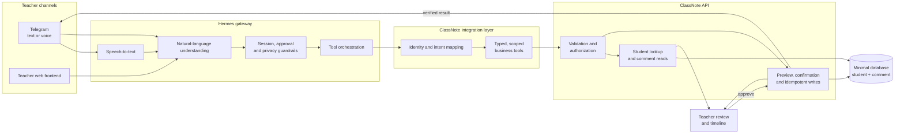

# ClassNote

A sanitized showcase of the ClassNote business architecture, selected business-code modules, and its integration approach for Hermes Agent.

This repository contains no production deployment code, real user data, API keys, credentials, server configuration, database credentials, or local file paths.

## Overview

ClassNote helps teachers turn short classroom observations into reviewable student comments. Hermes interprets the teacher's natural-language request and orchestrates only approved business-safe tools; the ClassNote API remains the boundary for validation and data access.

## System Architecture

The main boundary is simple: Hermes understands the teacher's request and orchestrates approved tools; the ClassNote API validates permissions and owns all business writes.

Hermes never writes the database directly. Every student lookup, preview, approval, and comment write crosses the typed integration layer and is revalidated by the ClassNote API.

## Documentation

- [Business and Hermes integration architecture](docs/business-architecture.md)
- [Hermes integration analyses 1–70](other/hermes-integration-notes.md)
- [Hermes orchestration and messaging analyses 71–80](other/hermes-orchestration-and-messaging.md)
- [Hermes safety and channel-control analyses 81–90](other/hermes-safety-and-channel-controls.md)
- [Hermes runtime and reliability analyses 91–100](other/hermes-runtime-and-reliability.md)
- [Hermes model and display-control analyses 101–110](other/hermes-model-and-display-controls.md)

## Code snapshot

The public snapshot contains the core backend business modules and teacher-facing frontend workflow pages. Deployment files, environment files, database snapshots, provider adapters, messaging credentials, and local development settings are intentionally excluded.

## Showcase scope

This is a reviewable architecture and business-code showcase, not a deployable product or a production Hermes configuration.
